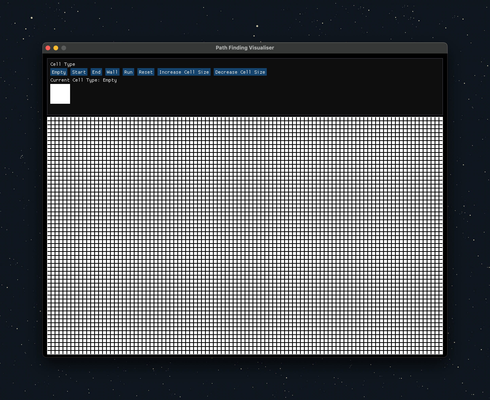
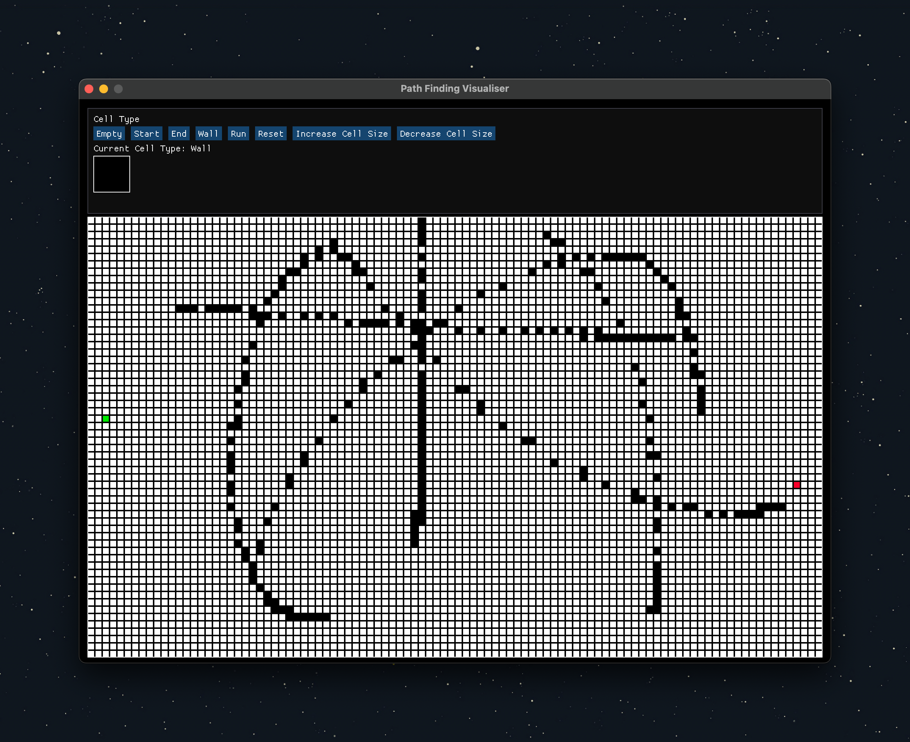
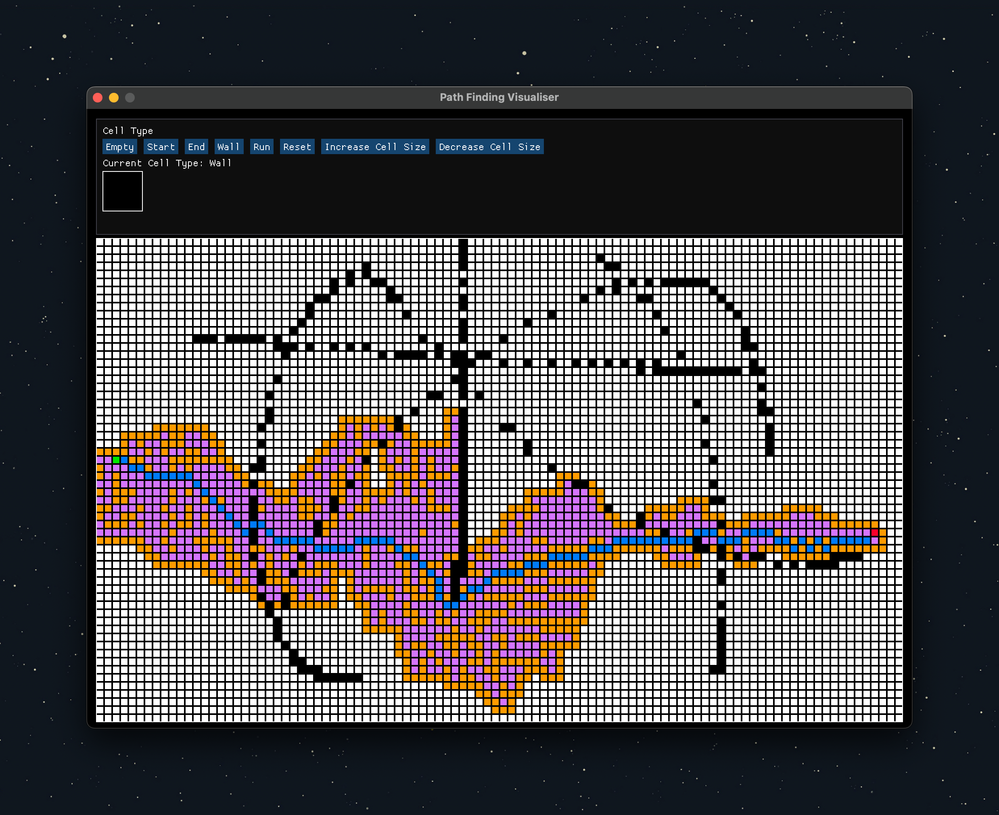
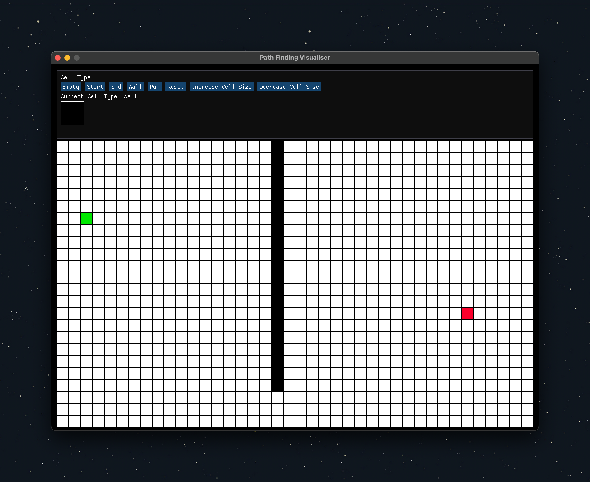
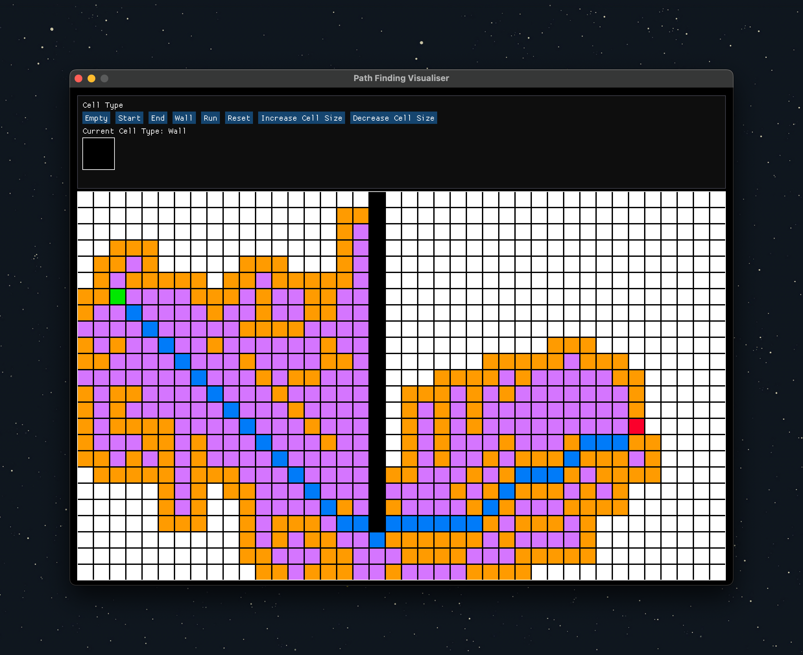

## A\* Pathfinding Algorithm Visualisation

A simple visualisation of the A\* pathfinding algorithm using C++ raylib and ImGui.

### Controls

- Select a node type from topbar
- Left click to place nodes
- Click "Run" to run the algorithm
- Click "Reset" to reset the grid
- Click "Increase Grid Size" to increase the grid size
- Click "Decrease Grid Size" to decrease the grid size

### Features

- Visualisation of the A\* pathfinding algorithm
- Customisable grid size
- Customisable node types

### Installation

1. Clone the repository with `--recursive` flag to clone the submodules
2. Run `mkdir build` to create a build directory
3. Run `cd build` to navigate to the build directory
4. Run `cmake ..` to generate the build files
5. Run `make` to build the project
6. Run `./path_finder` to run the project

### Screenshots

|                                    |                                    |                                    |
| :--------------------------------: | :--------------------------------: | :--------------------------------: |
|  |  |  |
|  |  |                                    |

## Author

- [Burak Şen](https://github.com/burakssen)
